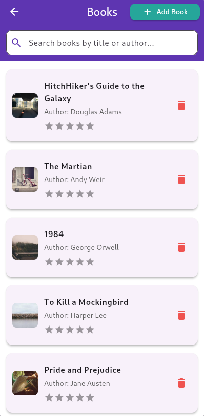
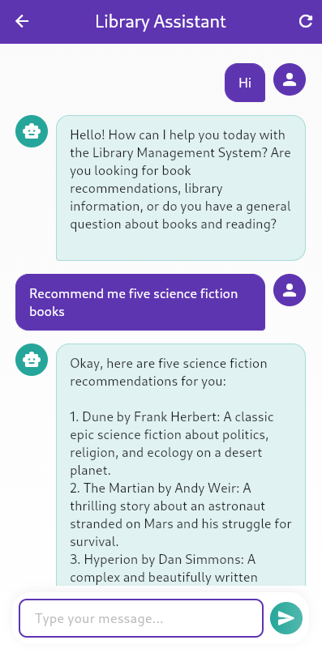
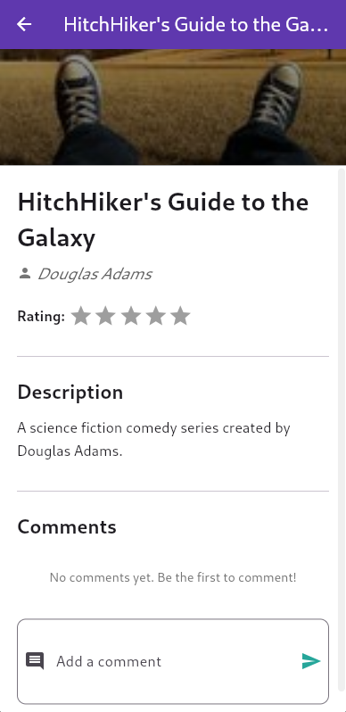
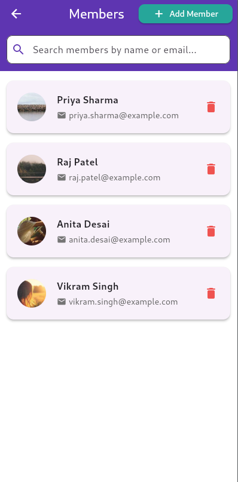

# LibraryHub 📚

A modern, intuitive Library Management System built with Flutter. This application streamlines the management of books and members with an elegant user interface and AI-powered assistance.


## Screenshots

<p align="center">
  
  
  
</p>

<p align="center">
  
  
  
</p>


## Features

- 📖 **Book Management** - Browse, search, add, edit, and rate books
- 👥 **Member Management** - Manage library memberships and member profiles
- 🤖 **AI Chat Assistant** - Get book recommendations powered by Google Gemini AI
- 🎨 **Modern UI** - Beautiful gradients, smooth animations, and intuitive navigation

## Getting Started

### Prerequisites

- Flutter SDK (3.3.4 or higher)
- Dart SDK (3.3.4 or higher)
- An IDE (VS Code, Android Studio, or IntelliJ IDEA)
- Google Gemini API key (for chatbot functionality)

### Installation

1. **Clone the repository**
   ```bash
   git clone https://github.com/AshishJii/LibraryHub.git
   cd LibraryHub
   ```

2. **Install dependencies**
   ```bash
   flutter pub get
   ```

3. **Set up environment variables**
   
   Create a `.env` file in the root directory:
   ```env
   API_KEY=your_google_gemini_api_key_here
   ```

4. **Add assets**
   
   Place your images in the `assets/` folder:
   - `library.png` - Library logo
   - `photo.jpg` - Admin photo

5. **Run the application**
   ```bash
   flutter run
   ```

## 📱 Supported Platforms

- ✅ Linux
- ✅ Windows
- ✅ macOS
- ✅ Android
- ✅ iOS
- ✅ Web

## 🛠️ Technologies Used

- **Flutter** - UI framework
- **Dart** - Programming language
- **Google Generative AI** - AI chatbot integration
- **flutter_rating_bar** - Star rating widget
- **flutter_dotenv** - Environment variable management
- **Material Design 3** - Design system

## Project Structure

```
lib/
├── main.dart                 # App entry point
├── home_screen.dart          # Home page with navigation
├── books_screen.dart         # Books list and management
├── book_detail_screen.dart   # Individual book details
├── members_screen.dart       # Members list and management
├── member_detail_screen.dart # Individual member details
├── chatbot_screen.dart       # AI chatbot interface
└── about_screen.dart         # About the library
```

## Environment Setup

To use the AI chatbot feature, you need a Google Gemini API key:

1. Visit [Google AI Studio](https://makersuite.google.com/app/apikey)
2. Create a new API key
3. Add it to your `.env` file as shown above

## 🤝 Contributing

Contributions are welcome! Please feel free to submit a Pull Request.